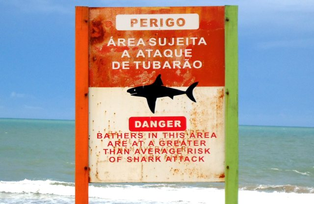

# Project: Data Cleaning and Manipulation with Pandas

## Overview

The goal of this project was to apply some learnings about data wrangling, cleaning, and manipulation with Pandas using the very messy data set [Shark Attack](https://www.kaggle.com/teajay/global-shark-attacks/version/1). 

